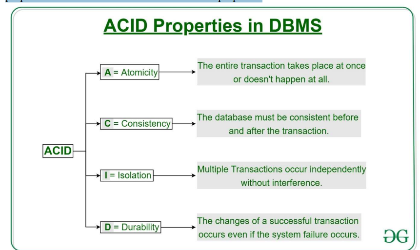

# Introduction of Database Normalization

Database normalization is a technique of organizing the data in the database. Normalization is a
systematic approach of decomposing tables to eliminate data redundancy and undesirable
characteristics such as insertion, update and delete anomalies. It is a multi-step process that puts data in
to tabular form by removing duplicated data from the relational table. 

*why we need normalization?*

we need normalization for various reasons 

- To Eliminate Data Redundancy
- To Prevent Data Anomalies
- To Ensure Data Integrity and Accuracy
- To Make the Database More Flexible

without normalization you find that it becomes difficult to handle and update the databses,without facing data loss.Insettion,updating and deleting anormalies are very frequent if databases are not normalize.Example

|s_id |s_name|s_address|subjects|
|---------|---------|----------|--------|
|1|john|c_420|software|
|2|felix|m_kiharu|maths|
|3|pricess|ja-ela|maths|
|4|john|c_420|computer|

*what is anomalies?*

**Anomalies** are problems or inconsistencies that occur when data is stored in an unnormalized or poorly structured database. The three main types are:

- **Updation Anomaly** To update the address of a student who occurs twice or more than twice in a table,
we will have to update S_Address column in all the rows, else data will be inconsistent.
- **Insertion Anomaly** – Suppose we have a student (S_id), name and address of a student but if student
has not opted for any subjects yet then we have to insert null, which leads to an insertion anomaly
- **Deletion Anomaly** – If (S_id) 1 has opted for one subject only and temporarily he drops it, when we
delete that row, entire student record will get deleted.

## Function Dependency 

Functional dependency in a database management system refers to the relationship between attributes in a table, where one attribute uniquely determines another. It helps maintain data accuracy and consistency by ensuring that the value of one attribute (the determinant) defines the value of another attribute (the dependent).

**Properties of functional Dependency in Databases**

**Reflexivity:**
If an attribute or set of attributes is a subset of another, it determines itself.
```Example: If A is part of AB, then AB → A.```

**Augmentation:**
Adding extra attributes to both sides of a dependency keeps it valid.
```Example: If A → B, then AC → BC.```

**Transitivity:**
If one attribute depends on another, and that one depends on a third, the first can determine the third.
```Example: If A → B and B → C, then A → C.```

## Types of Database Normalization


**1. First Normalization(1NF):**

 First Normal Form (1NF) is the first step in this process. It ensures that the structure of a database table is organized in a way that makes it easier to manage and query.

**Condition for first normalization**

A relation is said to be in First Normal Form (1NF) if:

- All the attributes contain only atomic  values.
- Each column contains values of a single type.
- Each record  is unique, meaning it can be identified by a primary key.
- There are no repeating groups or arrays in any row.

<u> *Example before normalization* </u>

**Student Table**
|Student|Age|Subject|
|------|-------|------|
|john|27|Computer,Physics|
|Ronny|22|Maths,History|
|Cammila|20|Kiswahil|

In the above table, student table has a multi-valued attribute, so it is not in 1NF. To make the table in 1NF we have to remove the multivalued attributes from the table as given below:


**Student Table**
|Student|Age|Subject|
|------|-------|------|
|john|27|Computer|
|john|27|Physics|
|Ronny|22|Maths,History|
|Cammila|20|Kiswahil|

**2nd Normalization Form**

In 2NF it eliminates partial dependencies by ensuring that non-key attributes depend only on the primary key. What this means, in essence, is that there should be a direct relationship between each column and the primary key, and not between other columns.

**Understanding 2NF**
A table is in 2NF if:
- It is already in First Normal Form.
- No partial dependency exists—every non-prime attribute  must fully depend on the entire primary key.

*Key Terms*
- Prime attribute − An attribute, which is a part of the candidate-key, is known as a prime attribute.
- Non-prime attribute − An attribute, which is not a part of the prime-key, is said to be a non-prime attribute.
- Partial Dependency: When a non-prime attribute depends on only a part of a composite primary key.

**Example of 2Nf**

**Student Table **
|Student|	Age	|Subject|
|-------|-------|-------|
|Adam	|20|	Bio|
|Adam	|20	|Maths|
|Alex	|21|	Maths|
|Steuart|	19|	Maths|

So in this student table their is partial dependency in which the Age attribute depends only on Student (not the full composite key (Student, Subject)), violating 2NF. 

**After Normalization**
### Table 1: Student_Info

| Student  | Age |
|----------|-----|
| Adam     | 20  |
| Alex     | 21  |
| Steuart  | 19  |

### Table 2: Student_Subjects

| Student  | Subject |
|----------|---------|
| Adam     | Bio     |
| Adam     | Maths   |
| Alex     | Maths   |
| Steuart  | Maths   |

While the candidate key is (Student, Subject), Age of student only depends on Student column.

**3rd Normalization Form(3NF)**

In 3NF every non-prime attribute of table must be dependent on primary key. The transitive functional
dependency must be removed from the table.  A transitive dependency occurs when a non-key attribute depends on another non-key attribute, which in turn depends on the primary key.


| Student_id | Student_Name | DOB       | Street       | City      | State    | Zip     |
|------------|--------------|-----------|--------------|-----------|----------|---------|

In this table Student_Id is the primary key, but street, city and State depends on Zip. The dependency
between Zip and other fields creates transtive dependency. Hence, to apply 3rd normal form, we need
to remove Street, City and State to a new table with Zip as a primary key.

 *Normalized Tables (After 3NF)*

**Table 1: Student_Detail**
| Student_id | Student_Name | DOB       |
|-----------------|--------------|-----------|

**Table 2: Address**
| Zip  | Street       | City      | State    |
|----------|--------------|-----------|----------|


# Transaction Management In DBMS

**Transaction** is a single logical unit of work which accesses and possibly modifies the
contents of a database. Transactions access data using read and write operations.
In order to maintain consistency in a database, before and after the transaction, certain
properties are followed. These are called ACID properties.



**Atomicity**

 This  mean that either the entire transaction takes place at once or doesn’t happen at all.
There is no midway i.e. transactions do not occur partially. Each transaction is considered as
one unit and either runs to completion or is not executed at all. It involves the following two
operations. 

- **Abort:** If a transaction aborts, changes made to database are not visible.
- **Commit:** If a transaction commits, changes made are visible. 

Example:
Consider the following transaction T consisting of T1 and T2: Transfer of 100 from
account X to account Y. 
Account X to account Y.

| Before: X : 500    | Y: 200    |
|--------------------|----------|
| Transaction T     |          |
| T1                | T2       |
| Read (X)          | Read (Y) |
| X := X - 100      | Y := Y + 100 |
| Write (X)         | Write (Y) |
| After: X : 400    | Y : 300  |

If the transaction fails after completion of T1 but before completion of T2.( say,
after write(X) but before write(Y)), then amount has been deducted from X but not added
to Y. This results in an inconsistent database state. Therefore, the transaction must be executed
in entirety in order to ensure correctness of database state. 


**Consistency**

This means that integrity constraints must be maintained so that the database is consistent
before and after the transaction. It refers to the correctness of a database. Referring to the
example above, The total amount before and after the transaction must be maintained.

```Total before T occurs = 500 + 200 = 700.```

```Total after T occurs = 400 + 300 = 700.```

Therefore, database is consistent. Inconsistency occurs in case T1 completes but T2 fails. As
a result T is incomplete.

**Isolation**

This property ensures that multiple transactions can occur concurrently without leading to the
inconsistency of database state. Transactions occur independently without interference.
Changes occurring in a particular transaction will not be visible to any other transaction until
that particular change in that transaction is written to memory or has been committed. This
property ensures that the execution of transactions concurrently will result in a state that is
equivalent to a state achieved these were executed serially in some order.

**Durability:**

This property ensures that once the transaction has completed execution, the updates and
modifications to the database are stored in and written to disk and they persist even if a system
failure occurs. These updates now become permanent and are stored in non-volatile memory.
The effects of the transaction, thus, are never lost. 
